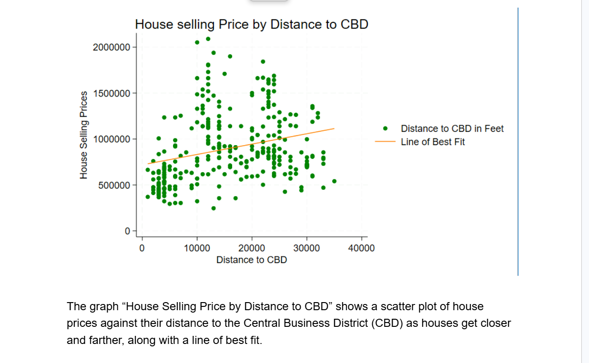
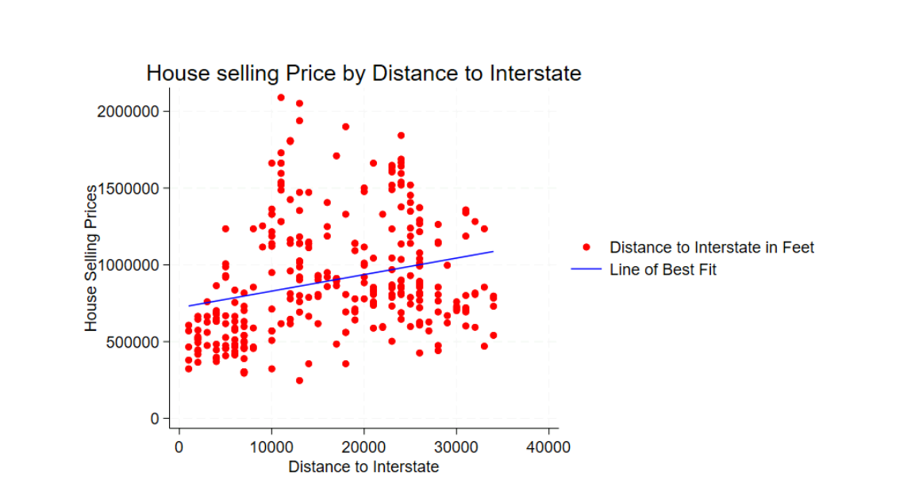

# Housing Price Valuation Model (OLS, STATA)

## Objective

Estimate a housing price model using Ordinary Least Squares (OLS) to identify the key determinants of residential property values and evaluate the statistical and economic significance of structural and location characteristics.

---

## Model

The housing price model is specified as:

Price = β₀ + β₁ Size + β₂ LotSize + β₃ Rooms + β₄ Bathrooms + β₅ Age + β₆ DistCBD + β₇ DistInterstate + β₈ Neighborhood + u

In log form (where applicable):

ln(Price) = β₀ + β₁ ln(Size) + β₂ ln(LotSize) + β₃ Rooms + β₄ Bathrooms + β₅ Age + β₆ DistCBD + β₇ DistInterstate + β₈ Neighborhood + u

Where:

- **Price** = selling price of the home  
- **Size** = square footage of the house  
- **LotSize** = lot square footage  
- **Rooms** = total number of rooms  
- **Bathrooms** = number of bathrooms  
- **Age** = property age  
- **DistCBD** = distance to central business district  
- **DistInterstate** = distance to nearest interstate  
- **Neighborhood** = categorical location indicator  
- **u** = error term  

---

## Methods

- Summary statistics and exploratory analysis  
- OLS regression with robust standard errors  
- Creation of neighborhood dummy variables  
- Joint significance testing of location variables  
- Model comparison before and after removing outliers  

---

## Project Structure

### Part A – Data Description and Summary Statistics
Overview of housing characteristics and descriptive statistics.
OLS regression including structural and location variables.

### Part B – Baseline Estimation
Creation of neighborhood dummy variables and re-estimation.  
Comparison of results before and after removing outliers.

## Part C – Relationship Between Price and Distance to CBD and Interstate

  

### House Selling Price by Distance to Interstate

  

The figure above illustrates the relationship between house selling prices and distance to the nearest interstate. The fitted regression line summarizes the average effect of interstate proximity on housing values.
The figure above displays a scatter plot of house selling prices against distance to the Central Business District (CBD), along with a fitted regression line.

### Part D – Investment Feasibility Analysis
Applied OLS housing price model with location analysis and investment feasibility evaluation.

---

## Key Takeaways

- **Structural attributes drive value.** Square footage and number of bathrooms are the strongest and most economically meaningful determinants of housing prices.

- **Location materially affects valuation.** Proximity to the Central Business District (CBD) significantly influences property values, confirming the importance of urban accessibility in housing markets.

- **Neighborhood fixed effects matter.** Controlling for neighborhood heterogeneity improves model explanatory power and isolates true structural effects.

- **Model refinement improves reliability.** Removing extreme outliers stabilizes coefficient estimates without materially reducing overall explanatory strength (R² ≈ 0.58).

- **Renovation decisions can be evaluated quantitatively.** Applying regression results to an NPV framework shows that adding a bathroom is economically justified under reasonable cost assumptions.

- **Empirical results support practical investment decisions.** The integration of econometric modeling with capital budgeting demonstrates how statistical analysis can inform real-world real estate strategy.
